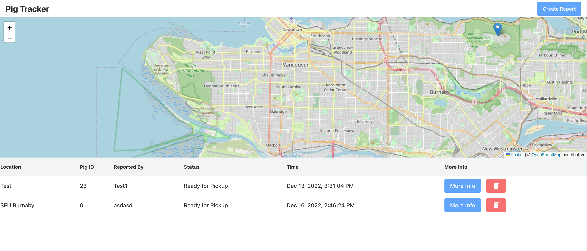

# Pig Tracker - Angular Final Project

Developed by Sarah Vo from scratch as a final project for SFU CMPT 272 - Web Development I

This project was generated with [Angular CLI](https://github.com/angular/angular-cli) version 15.0.1.

## Live demo 👩🏻‍💻

Visit the demo version [here!](https://sarah-vo.github.io/272-finalProject/)

## Pig Tracker 🐷

<b>Pig Tracker</b> helps a farmer out in an imaginary scenario that all of his pigs are lost in Metro Vancouver and needs help from the community to track and capture the pigs!

## What it does 🤔
- Allows users to enter their personal information and the location of the sighted pigs
- The location of the pigs will be displayed on a map for easier visualization
- The farmer can choose to delete the individual log (password protected)

## What I've learnt 🧠
- Fully integrated TailwindCSS and used Material UI for the first time!
- Used a Leaflet and OpenStreetMap for location visualization
- A lot of Angular stuff
  - Directive is a very interesting feature that Angular has
  - MVC, SOLID, and Dependency Injection

## What I wish to implement 📝
- Accessibility features
- Better UI and Visualization
- A lot more!!

## Technology used 💽

## Development server

Run `ng serve` for a dev server. Navigate to `http://localhost:4200/`. The application will automatically reload if you change any of the source files.
